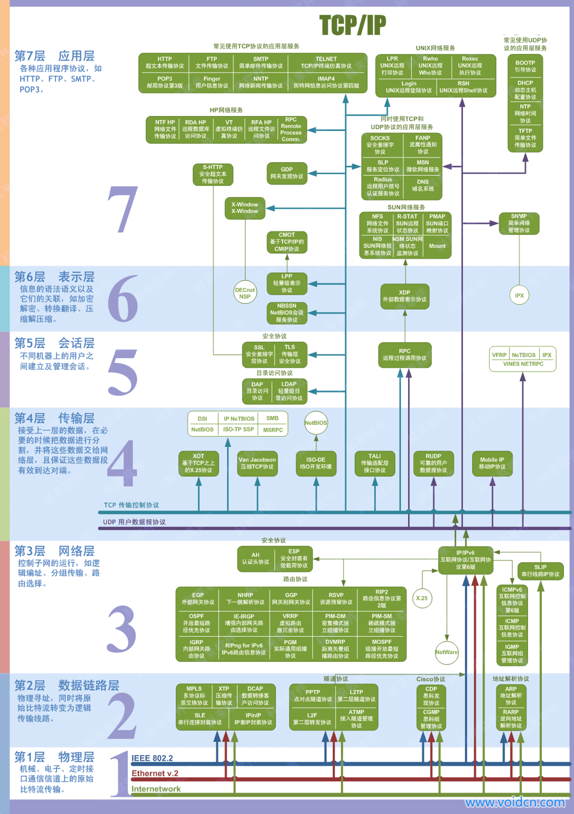

# SDN手册-计算机网络基础

[1. 前言 · SDN手册](https://tonydeng.gitbooks.io/sdn/content/)

[第1章 概述 · TCP/IP协议详解卷一 · 看云](https://www.kancloud.cn/lifei6671/tcp-ip/139757)

<figure><figcaption></figcaption></figure>

*   IP地址分类

    [IP地址的分类及范围详解：A、B、C、D、E五类是如何划分的\_a类地址\_墨渧的博客-CSDN博客](https://blog.csdn.net/m0\_37732829/article/details/94717850)

    1.  `A:0-127，其中0代表任何地址，127为回环测试地址，因此，A类ip地址的实际范围是1-126.什么是回环测试地址`？

        回环测试地址是一种特殊的IP地址，用于在本地主机上进行网络测试和通信。其中，IP地址的回环测试地址范围是127.0.0.0到127.255.255.255，其中最常用的回环测试地址是127.0.0.1

        回环测试地址被用于将数据包发送给本地主机，已模拟网络通信的过程。当一个数据包的目标IP地址设置为回环测试地址时，操作系统会将数据包传递给本地主机上的网络协议栈进行处理，而不会通过网络接口发送到网络上。这样可以用于测试网络应用程序的功能和性能以及进行本地主机的自我诊断。回环测试地址在实际的网络通信中并不会被路由器或其他网络设备转发，它们只在本地主机上有效，因此回环测试地址是用于本地主机内部的测试和通信，而不是用于实际的网络通信。
*   IP首部、MAC首部、TCP首部

    [MAC首部 IP首部 TCP首部介绍\_大1234草的博客-CSDN博客](https://blog.csdn.net/sinat\_38816924/article/details/107558223)

    [实战！我用 Wireshark 让你“看见“ TCP](https://zhuanlan.zhihu.com/p/142665708)
*   PMTU

    Path Maximum Transmisssion Unit，是指路径最大传输单元，它的用途就是哦动态地确定从发送端到接收端整个路径上的最小MTU，以避免数据包在传输过程中需要进行分片。

    MTU是指网络中传输的数据包的最大大小，不同的网络设备和链路可能有不同的MTU大小。当数据包的大小超过某个设备或链路的MTU时，数据包就需要进行分片，将其分割成更小的片段进行传输。

    PMTU是一种机制，用于确定整个路径上的最小MTU，发送端在发送数据包时，会设置一个初始的MTU大小。当数据包经过中间的路由器或链路时，如果发现数据包的大小超过了该路由器或链路的MTU，路由器会发送一个ICMP报文给发送端，提示发送端需要调整MTU大小。发送端接收到ICMP之后，会降低数据包的MTU大小，并重新发送，这个过程会不断重复，知道找到整个路径上的最小MTU。

    通过PMTU发现，发送端可以动态地确定整个路径上的最小MTU，从而避免了数据包的分片和重传，提高了传输效率和可靠性。

    PMTU只支持TCP，对其他协议比如UDP无效，而且，如果发送方已经开启了PMTU，那么它发送的所有TCP/IP包的DF标志都被设置为1即不再允许分包。当网络路径上某个路由器发现发送者的包因为超过前面转发路径的MTU而无法发送时，然后发送者就会在它的路由表中将该MTU保存下来，再使用较小的MTU重新发出新的较小的包。
*   ARP

    [4.2 一个例子 · TCP/IP协议详解卷一 · 看云](https://www.kancloud.cn/lifei6671/tcp-ip/139996)

    ### arp

    ***

    address resolution protocol地址解析协议，因为链路层通信根据48bit（6个字节）以太网地址（硬件地址）来确定目的接口，而地址解析协议负责将32bit(4个字节)IP地址映射到对应的硬件地址，而RARP负责相反的过程，常用于无盘系统。

    #### arp高速缓存

    每台主机上都有一个ARP高速缓存，这是arp高校运行的关键，缓存中每一项的生存时间为20分钟，但是不完成的表项生存时间一般为3分钟。如下面：

    ```bash
    # arp -a? (192.168.0.16) at 00:1b:21:b9:9f:d4 [ether] on eth0? (192.168.0.6) at 00:1b:21:b9:9f:d4 [ether] on eth0? (192.168.13.233) at 00:16:3e:01:7a:b2 [ether] on eth0? (192.168.13.254) at <incomplete> on eth0
    ```

    其中最后一个表项就是不完整表项，说明在“eth0”网络接口上当前未知该ip地址的MAC地址后面的“on eth0”意思是IP地址与MAC地址关联在“eth0”网络接口上，意味着映射是通过eth0网络接口进行的。

    通过运行“ifconfig”命令获得的网络接口信息。它显示了两个网络接口：ens33和lo。

    ```
    ens33: flags=4163<UP,BROADCAST,RUNNING,MULTICAST>  mtu 1500
            inet 192.168.158.129  netmask 255.255.255.0  broadcast 192.168.158.255
            inet6 fe80::d475:d050:34b0:228b  prefixlen 64  scopeid 0x20<link>
            ether 00:0c:29:da:77:fc  txqueuelen 1000  (Ethernet)
            RX packets 1446  bytes 1885182 (1.8 MB)
            RX errors 0  dropped 0  overruns 0  frame 0
            TX packets 901  bytes 69158 (69.1 KB)
            TX errors 0  dropped 0 overruns 0  carrier 0  collisions 0

    lo: flags=73<UP,LOOPBACK,RUNNING>  mtu 65536
            inet 127.0.0.1  netmask 255.0.0.0
            inet6 ::1  prefixlen 128  scopeid 0x10<host>
            loop  txqueuelen 1000  (Local Loopback)
            RX packets 257  bytes 21165 (21.1 KB)
            RX errors 0  dropped 0  overruns 0  frame 0
            TX packets 257  bytes 21165 (21.1 KB)
            TX errors 0  dropped 0 overruns 0  carrier 0  collisions 0

    ```

    ```
    ens33是一个以太网接口，具有以下属性：
    - flags字段指示接口的状态，4163表示接口处于UP（开启）、BROADCAST（支持广播）、RUNNING（运行中）和MULTICAST（支持多播）模式。
    - mtu字段指示最大传输单元的大小为1500字节。
    - inet字段显示接口的IPv4地址为192.168.158.129，子网掩码为255.255.255.0，广播地址为192.168.158.255。
    - inet6字段显示接口的IPv6地址为fe80::d475:d050:34b0:228b，前缀长度为64。
    - ether字段显示接口的MAC地址为00:0c:29:da:77:fc。
    - txqueuelen字段指示发送队列的长度为1000。
    - RX packets和TX packets字段分别显示接收和发送的数据包数量。
    - RX errors和TX errors字段显示接收和发送过程中的错误数。
    - dropped字段显示丢弃的数据包数量。
    - overruns字段显示接收和发送过程中的溢出数。
    - frame字段显示接收过程中的帧错误数。
    - collisions字段显示发生的碰撞次数。

    lo是一个回环（loopback）接口，具有以下属性：
    - flags字段指示接口的状态，73表示接口处于UP（开启）、LOOPBACK（回环）和RUNNING（运行中）模式。
    - mtu字段指示最大传输单元的大小为65536字节。
    - inet字段显示接口的IPv4回环地址为127.0.0.1，子网掩码为255.0.0.0。
    - inet6字段显示接口的IPv6回环地址为::1，前缀长度为128。
    - loop字段指示该接口是一个回环接口。
    - txqueuelen字段指示发送队列的长度为1000。
    - RX packets和TX packets字段分别显示接收和发送的数据包数量。
    - RX errors和TX errors字段显示接收和发送过程中的错误数。
    - dropped字段显示丢弃的数据包数量。
    - overruns字段显示接收和发送过程中的溢出数。
    - carrier字段显示发生的载波错误数。
    - collisions字段显示发生的碰撞次数。
    ```

    ```
    为什么有lo接口？
    lo是回环接口，用于在本地计算机上进行内部通信。它是一个虚拟接口，不连接到任何物理设备，而是将数据包从发送端直接传送到接收端，不经过网络。

    lo接口主要用于以下情况：
    1. 测试和调试：在开发和测试过程中，可以使用lo接口进行本地回环测试，以验证应用程序或网络服务的功能。
    2. 网络服务：某些网络服务（如本地代理服务器、本地DNS服务器等）可能需要使用lo接口来处理本地计算机上的网络请求。
    3. 网络连接模拟：在某些情况下，需要模拟网络连接以测试应用程序的行为。lo接口可以用于模拟网络连接，以便在本地计算机上进行测试和调试。
    4. 安全性和隔离：lo接口可以用于在本地计算机上创建安全的网络环境，以隔离敏感数据或服务，防止外部访问。

    总之，lo接口是一个用于本地回环通信的虚拟接口，用于在本地计算机上进行内部测试、服务和模拟网络连接等操作。
    ```

    ```
    下面是一个简单的Ubuntu系统中使用lo接口进行回环实验的示例：

    1. 打开终端，输入以下命令以创建一个简单的回环服务：
    ```

    sudo nc -l 127.0.0.1 8080 \`\`\` 这将在本地计算机上的8080端口上创建一个监听服务。

    1.  在同一台计算机上打开新的终端，输入以下命令以连接到回环服务：

        ```
        telnet 127.0.0.1 8080
        ```

        这将连接到本地计算机上的8080端口。
    2. 在连接的终端中，输入一些文本消息并按Enter键发送。你将会看到回环服务终端接收到你发送的消息。

    ```

    ### arp分组格式

    arp协议的帧类型为0x0806

    ### arp代理

    arp代理涉及到的是不同网段的arp协议通信，而且是没有配置网关的情况下，开启arp proxy后才能实现跨网段arp查询；如果配置了网关，就是正常查询，如下。

    正常ARP：

    1. 主机A希望向主机B发送IP报文。先向ARP查询主机B的IP地址，ARP根据掩码发现自己与目的IP不在同一个网段，此时ARP将查询网关(默认路由)的MAC地址，如果连网关的MAC地址都没有的话则对网关地址再进行同网段ARP查询，查询后将<网关IP,网关MAC>和<主机B IP,网关MAC>两项放入ARP表中；
    2. 主机A将IP报文发往网关。此时：目的IP=主机B，目的MAC=网关，源IP和源MAC=主机A；
    3. 网关收到IP报文后发现目的IP根本不是他，于是网关一方面将主机A的IP与MAC地址放入ARP表，另一方面去自己的ARP表中查找目的IP的MAC地址，如果没有的话在主机B所在的网段进行同网段ARP查询，查询后将主机B的IP与MAC地址放入自己的ARP表；
    4. 网关向主机B发送IP数据报。此时：目的IP=主机B，目的MAC=主机B，源IP=主机A，源MAC=网关；
    5. 最后主机B收到IP数据报并将<主机A的IP,网关的MAC>放进自己的ARP表中。

    代理ARP：

    PC没有设置网关，在和不同网段通信的时候，直接发送ARP广播包，直接询问目的网段，而这时，最近一个网关路由器充当一个代理的功能，回应自己的MAC地址给他，前提是这个路由器有ARP代理的功能；

    ### 免费ARP

    ```

    免费ARP（Gratuitous ARP）是一种特殊类型的ARP请求，用于更新网络中其他设备的ARP缓存。它是由发送者主动发送的ARP请求，而不是作为响应其他设备的请求而发送的。

    免费ARP的作用和用途如下： 1. 更新网络拓扑：当设备的网络接口地址（如IP地址或MAC地址）发生变化时，发送免费ARP可以通知网络中的其他设备更新其ARP缓存，以便正确地路由和转发数据。 2. 避免IP地址冲突：当设备连接到网络时，它可以发送免费ARP请求来检查网络上是否有其他设备使用了相同的IP地址。如果有冲突，其他设备将收到免费ARP请求并更新其ARP缓存。 3. 快速网络恢复：在网络故障或设备重启后，发送免费ARP可以帮助设备快速恢复网络连接，更新其他设备的ARP缓存。

    ```

    [什么是免费ARP-看这篇就够了_jasonj33的博客-CSDN博客](<https://blog.csdn.net/wjz110201/article/details/115114238>)

    主机发送`ARP`请求查找自己的IP地址。通常有两个用途：

    - （1）确认网络中是否有其他主机设置了相同的`IP`地址；
    - （2）当主机的物理地址改变了，可以通过免费`ARP`更新更新路由器和其他主机中的高速缓存。

    ### RARP

    1. 通常用于无盘系统，无盘系统从物理网卡上读到硬件地址后，发送一个RARP请求查询自己的Ip地址；
    2. 协议格式与ARP协议格式一致，只不过帧类型代码为0x8035
    3. 使用链路层广播，这样阻止了大多数路由器转发rarp请求，只返回很小的信息，即ip地址

    第三点的意思是：

    ```

    在RARP（Reverse Address Resolution Protocol，反向地址解析协议）中，RARP请求通过链路层广播的方式发送。由于链路层广播的特性，RARP请求会被发送到同一网络中的所有设备，但不会被路由器转发到其他网络。

    这种做法的目的是为了限制RARP请求的范围，避免不必要的网络流量。因为RARP请求只需要获取与MAC地址相对应的IP地址，因此只需要返回很小的信息即可，即IP地址。通过链路层广播，只有同一网络中的设备会收到RARP请求，并且只有拥有相应IP地址的设备会响应该请求，其他设备不会做出任何响应。

    在RARP中，设备响应请求并提供相应的IP地址，是通过检查自己的ARP缓存表来判断的。 当收到RARP请求时，设备会检查自己的ARP缓存表，该表记录了MAC地址与IP地址之间的对应关系。如果设备的ARP缓存表中存在与RARP请求中的MAC地址相匹配的记录，那么它会返回该记录中对应的IP地址作为响应。 如果设备的ARP缓存表中没有与RARP请求中的MAC地址相匹配的记录，那么它将不会返回任何信息。 因此，设备通过检查自己的ARP缓存表来判断是否拥有与RARP请求中的MAC地址相对应的IP地址，并根据情况进行响应。 \`\`\`
*   ICMP

    差错报告机制，经常被认为是IP层的一个组成部分，传递差错报文以及其他需要注意的信息；ICMP报文是在IP数据报内部被传输的。

    [什么是ICMP？ICMP如何工作？ - 华为](https://info.support.huawei.com/info-finder/encyclopedia/zh/ICMP.html)

    这篇文章语言很好，可以记忆\~

    ```
    Tracert和Traceroute是两个网络诊断工具，用于追踪数据包在网络中的路径。它们的主要区别如下：

    1. 名称：Tracert是Windows系统中的命令行工具，而Traceroute是Unix/Linux系统中的命令行工具。

    2. 语法：Tracert命令在Windows系统中使用，语法为"tracert <目标IP地址或域名>"；而Traceroute命令在Unix/Linux系统中使用，语法为"traceroute <目标IP地址或域名>"。

    3. 实现方式：Tracert使用ICMP协议进行数据包的追踪，而Traceroute使用UDP协议进行数据包的追踪。

    4. 输出结果：Tracert在Windows系统中输出结果以每个路由器的IP地址显示，同时还显示每个路由器的往返时间（RTT）；而Traceroute在Unix/Linux系统中输出结果以每个路由器的域名显示，同时还显示每个路由器的往返时间（RTT）。

    5. 默认端口：Tracert使用ICMP Echo Request消息，默认使用的端口号为33434；而Traceroute使用UDP数据包，默认使用的端口号为33434。

    总的来说，Tracert和Traceroute在功能上是相似的，都可以用于追踪数据包在网络中的路径，但是它们的实现方式、输出结果和使用平台有所不同。
    ```

    ```bash
    traceroute to www.baidu.com (120.232.145.185), 30 hops max, 60 byte packets
     1  _gateway (192.168.158.2)  1.779 ms  1.586 ms  1.448 ms
     2  * * *
     3  * * *
     4  * * *
     5  * * *
     6  * * *
     7  * * *
     8  * * *
     9  * * *
    10  * * *
    11  * * *
    12  * * *
    13  * * *
    14  * * *
    15  * * *
    16  * * *
    17  * * *^C
    ```

    [第6章 ICMP：Internet控制报文协议 · TCP/IP协议详解卷一 · 看云](https://www.kancloud.cn/lifei6671/tcp-ip/140197)
*   Route

    这里要弄清楚一个概念：路由和转发

    ```
    路由是指确定数据包从源主机到目标主机的路径的过程。它涉及到根据目标IP地址和路由表中的信息，选择最佳的路径来传输数据包。路由是在网络层（例如IP层）进行的，它决定了数据包如何在网络中进行跳转和传输。

    转发是指在网络设备（如路由器、交换机）上将数据包从一个接口转发到另一个接口的过程。当一个设备接收到一个数据包时，它会根据数据包的目标IP地址和自身的路由表，决定将数据包发送到哪个接口。转发是在数据链路层或网络层进行的，它是实际将数据包从一个网络节点传递到另一个网络节点的过程。

    简而言之，路由是决定数据包的路径，而转发是将数据包沿着这条路径进行传输。路由是一个更广义的概念，它涉及到网络中的多个节点和路径选择算法。转发是路由的一部分，它是在单个网络设备上执行的操作，将数据包从一个接口转发到另一个接口。
    【举例说明】
    假设有两个网络A和B，它们之间通过一个路由器R连接。

    在网络A中有一台主机H1，它要发送一个数据包到网络B中的主机H2。

    在这个例子中，路由和转发的区别可以通过以下步骤来说明：

    1. 路由：主机H1要将数据包发送到主机H2，首先它需要确定数据包的目标IP地址，即H2的IP地址。然后，H1会查看自己的路由表，找到到达网络B的最佳路径。这个路径可能是通过默认网关或者静态路由指定的。路由的过程是在主机H1上进行的，它决定了数据包应该通过哪个网关或路由器发送。

    2. 转发：一旦主机H1确定了数据包应该通过哪个网关发送，它将数据包发送到路由器R。在路由器R上，转发的过程开始。路由器R接收到数据包后，会检查数据包的目标IP地址，并查看自己的路由表，找到到达目标网络B的最佳路径。然后，路由器R将数据包从一个接口转发到另一个接口，以便将数据包发送到网络B中的主机H2。这个过程是在路由器R上进行的，它是将数据包从一个网络节点传递到另一个网络节点的实际操作。

    总结来说，路由是在主机上决定数据包的路径，转发是在路由器上将数据包从一个接口转发到另一个接口。路由是一个决策过程，转发是一个操作过程。
    ```

    还要弄清楚概念：ICMP重定向差错报文和ICMP路由器发现报文

    ```
    ICMP（Internet Control Message Protocol）路由器发现报文是一种网络协议，用于在网络中发现路由器并获取路由器的相关信息。

    ICMP路由器发现报文的主要目的是帮助主机或其他路由器发现网络中的路由器，并了解到达目标网络的最佳路径。它通过发送ICMP Echo Request（回显请求）报文到目标IP地址，然后接收目标IP地址所在网络上的路由器发送的ICMP Echo Reply（回显应答）报文。

    当主机或其他路由器发送ICMP Echo Request报文时，目标网络上的路由器会接收到该报文并根据自己的路由表确定下一跳的路由器。然后，它会将ICMP Echo Reply报文发送回源主机或路由器，包含了自己的IP地址和其他相关信息。源主机或路由器收到ICMP Echo Reply报文后，可以根据其中的信息来确定到达目标网络的最佳路径。

    通过ICMP路由器发现报文，主机或其他路由器可以了解到网络中的路由器，并选择最佳的路径来发送数据包。这有助于优化网络通信，提高数据传输的效率。

    ICMP路由器发现报文和ICMP重定向差错是两种不同的ICMP报文，它们有不同的功能和用途。

    ICMP路由器发现报文用于主机或其他路由器发现网络中的路由器，并获取路由器的相关信息，以便确定数据包的最佳路径。它通过发送ICMP Echo Request报文到目标IP地址，然后接收目标网络上的路由器发送的ICMP Echo Reply报文。

    ICMP重定向差错报文用于告知主机或其他路由器，有一个更佳的路由可以用于到达特定目标网络。当主机或路由器发送数据包到目标网络时，如果接收到目标网络上的路由器发送的ICMP重定向差错报文，它会更新自己的路由表，以便将数据包发送到更佳的路由器。

    总结来说，ICMP路由器发现报文用于发现网络中的路由器和获取相关信息，而ICMP重定向差错报文用于告知主机或路由器有更佳的路由可用。它们的目的和作用不同，但都是通过ICMP报文来实现网络通信的优化和路由的更新。
    ```

    ospf协议：

    `开放式最短路径协议（OSPF）：基于链路状态，每个路由器向其同一管理域的所有其它路由器发送链路状态广播信息，并将自制域划分为区，并根据区的位置执行区内路由选择和区间路由选择。`

    ```
    开放式最短路径优先（OSPF）是一种基于链路状态的动态路由协议，用于在自治系统（AS）内部进行路由选择。

    OSPF通过在同一管理域内的所有路由器之间交换链路状态信息（LSA），来建立一个拓扑图，并计算出每个路由器到达目标网络的最短路径。每个路由器都会发送链路状态广播信息，包含自己所知道的网络和链路的状态信息，例如链路的带宽、延迟、可靠性等。

    在OSPF中，自治系统（AS）被划分为多个区域（Area），每个区域内的路由器会交换链路状态信息，并计算出区域内的最短路径。而不同区域之间的路由选择是通过区间路由选择（Inter-Area Routing）来实现的，即每个区域的边界路由器（Area Border Router）负责将区域之间的路由信息传递。

    OSPF使用最短路径优先（Shortest Path First，SPF）算法来计算最短路径，并将该最短路径作为路由表中的路由信息。通过OSPF，路由器可以根据链路状态信息来选择最优的路径，以实现高效的数据转发和路由选择。

    总结来说，OSPF是一种基于链路状态的动态路由协议，它通过交换链路状态信息来建立拓扑图，并计算出最短路径。它将自治系统划分为区域，并在区域内执行区内路由选择和区间路由选择，以实现高效的路由选择和数据转发。

    OSPF（Open Shortest Path First）是一种开放式的、基于链路状态的动态路由协议，用于在自治系统（AS）内部进行路由选择。它是一个内部网关协议（IGP），用于在单个自治系统内的路由器之间交换路由信息，并计算出最短路径。

    OSPF的设计目标是提供高可靠性、快速收敛、支持大规模网络和可扩展性。以下是OSPF的一些关键特点和工作原理：

    1. 链路状态数据库：每个OSPF路由器维护一个链路状态数据库（Link State Database），其中存储了整个自治系统的拓扑图。链路状态数据库包含了每个路由器所知道的网络和链路的状态信息。

    2. 链路状态广播：OSPF路由器会周期性地向同一管理域内的其他路由器发送链路状态广播信息，以更新链路状态数据库。这些广播信息包含了路由器所连接的网络和链路的状态信息。

    3. SPF计算：OSPF使用最短路径优先（SPF）算法来计算最短路径。每个路由器根据链路状态数据库中的信息，计算出到达目标网络的最短路径，并将该路径作为路由表中的路由信息。

    4. 区域划分：为了提高可扩展性和减轻链路状态数据库的负担，OSPF将自治系统划分为多个区域（Area）。每个区域内的路由器只交换本区域的链路状态信息，并计算出区域内的最短路径。而不同区域之间的路由选择是通过区间路由选择（Inter-Area Routing）来实现的。

    5. 路由器类型：OSPF定义了不同类型的路由器，包括内部路由器（Internal Router）、边界路由器（Border Router）和自治系统边界路由器（ASBR）。不同类型的路由器在链路状态数据库的更新和路由选择中扮演不同的角色。

    通过使用OSPF，网络管理员可以实现高可靠性、快速收敛和高效的路由选择。OSPF支持多种路由器类型和区域划分，以适应不同规模的网络环境。它是一种广泛应用于企业网络和互联网中的重要动态路由协议。
    ```

    再明确概念：STP协议和Trill协议

    ```
    假设有一个企业网络拓扑，其中有多个交换机连接成一个环形结构。现在我们使用STP和TRILL协议来解决环路问题。

    1. 使用STP协议：
       - 在这种情况下，STP协议将选择一个交换机作为根交换机，其它交换机将成为非根交换机。
       - 根交换机将成为网络中所有冗余路径的根，其它交换机将通过决策树选择最佳路径。
       - 当环路出现时，STP协议将通过将某些链路置于阻塞状态来消除环路，以确保数据包不会无限循环。
       - STP协议的操作是通过交换机之间的BPDU（Bridge Protocol Data Unit）消息来实现的，这些消息用于交换拓扑信息和选择根交换机。

    2. 使用TRILL协议：
       - 在这种情况下，TRILL协议将使用IS-IS（Intermediate System to Intermediate System）协议来构建一个有向无环图（DAG）。
       - TRILL交换机将使用IS-IS协议来学习网络拓扑，并计算出最佳路径。
       - 当环路出现时，TRILL协议将使用IS-IS协议中的最小生成树算法来消除环路。
       - TRILL协议的操作是通过交换机之间的TRILL数据包来实现的，这些数据包包含有关网络拓扑和路径的信息。

    总结：
    STP协议和TRILL协议都可以解决环路问题，但它们的实现方式和操作略有不同。STP协议通过选择根交换机和阻塞链路来消除环路，而TRILL协议通过构建有向无环图和计算最佳路径来消除环路。
    ```

    MPLS

    ```
    MPLS（Multi-Protocol Label Switching）是一种用于网络路由和转发的技术。它通过在数据包的头部添加一个标签（Label），并根据这个标签来进行路由决策和转发，从而提高网络的传输效率和可靠性。

    MPLS的工作原理是在网络中建立一个标签交换路径（Label Switched Path，LSP），将数据包沿着这个路径进行传输。在数据包进入网络时，路由器会根据目的IP地址和路由表确定下一跳，并为数据包分配一个唯一的标签。随后，路由器将标签添加到数据包的头部，并将数据包转发到下一跳。在数据包传输过程中，路由器根据标签来进行转发，而不需要每次都进行复杂的路由查找。当数据包到达目的地时，路由器会根据标签将数据包解封，并将其传递给目的主机。

    MPLS的优点包括：
    1. 提高网络传输效率：MPLS通过标签交换的方式来进行路由和转发，避免了每次数据包传输都进行复杂的路由查找，从而提高了网络的传输效率。
    2. 提供灵活的服务质量（Quality of Service，QoS）支持：MPLS可以为不同类型的数据包分配不同的服务质量，从而满足不同应用对网络延迟、带宽和可靠性的要求。
    3. 支持虚拟专用网络（Virtual Private Network，VPN）：MPLS可以通过标签来实现虚拟专用网络，使得多个组织可以共享同一网络基础设施，同时保证数据的安全性和隔离性。

    以下是一些MPLS的实践案例：
    1. 企业网络中的MPLS VPN：企业可以使用MPLS来建立一个虚拟专用网络，将多个分支机构连接在一起，实现数据的安全传输和共享。
    2. 云服务提供商的MPLS网络：云服务提供商可以使用MPLS来构建一个高效、可靠的网络基础设施，为用户提供稳定的云服务。
    3. 电信运营商的MPLS网络：电信运营商可以使用MPLS来提供各种网络服务，如互联网接入、虚拟专用网络和语音通信等。

    总之，MPLS是一种用于网络路由和转发的技术，通过在数据包的头部添加标签来进行路由决策和转发，从而提高网络的传输效率和可靠性。它在企业网络、云服务和电信运营商等领域都有广泛的应用。
    ```
*   Switch

    三层交换机支持三层转发（路由），也支持二层转发。三层交换机是通过交换芯片实现路由转发功能，而路由器则是通过CPU转发。

    白牌交换机

    ```
    白牌交换机是一种没有品牌标识的交换机设备，它通常由一家制造商制造，但没有特定的品牌名称或商标。白牌交换机通常以低成本和灵活性为特点，供应商可以根据客户的需求进行定制和配置。

    白牌交换机的制造商通常是由原始设备制造商（Original Equipment Manufacturer，OEM）或原设备制造商（Original Design Manufacturer，ODM）提供。这些制造商可能会根据客户的要求，定制特定功能、端口数量、速率和其他特性的交换机。

    白牌交换机的优势包括：

    1. 低成本：由于没有品牌标识和营销费用，白牌交换机通常价格较低，可以提供更具竞争力的解决方案。

    2. 灵活性：白牌交换机可以根据客户的需求进行定制和配置，以满足特定的网络需求，例如特定的端口类型、速率、协议支持等。

    3. 可扩展性：白牌交换机通常提供可扩展的模块化设计，以便根据需要增加或减少端口数量和功能。

    然而，使用白牌交换机也存在一些潜在的风险和挑战。由于缺乏品牌认可和技术支持，可能存在质量和可靠性方面的问题。此外，白牌交换机可能缺乏一些高级功能和性能特性，无法与一些知名品牌的交换机相媲美。

    因此，在选择是否使用白牌交换机时，需要综合考虑成本、性能、功能和支持等因素，并根据实际需求做出决策。
    ```

    ACL，Access Control List访问控制列表，规则集合，所谓规则是指描述报文匹配条件的判断语句。ACL本质上是一种报文过滤器，规则是过滤器的滤芯。

    ACL的出现主要是为了应对网络安全和Qos的问题：比如企业重要服务器的资源被随意地访问，容易泄露信息造成安全隐患；公网病毒入侵企业内网影响安全；网络带宽被各类业务随意挤占，Qos要求最要的语音和视频业务带宽得不到保障就会造成用户体验很差。

    [什么是ACL - 华为](https://support.huawei.com/enterprise/zh/doc/EDOC1100086646)
*   UDP

    首部8字节，源端口号、目的端口号、UDP长度和UDP校验和分别是两字节

    ```
    在实际的UDP通信中，发送进程是指发送数据的应用程序，而接收进程是指接收数据的应用程序。

    具体的UDP通信过程如下：
    1. 发送进程将要发送的数据传递给UDP协议层。
    2. UDP协议层将数据封装成UDP数据报，包括源端口号、目的端口号、数据长度等信息。
    3. UDP协议层将UDP数据报传递给网络层，网络层根据目的IP地址找到合适的路由，将UDP数据报发送出去。
    4. 接收进程所在主机的网络层接收到UDP数据报后，将其传递给UDP协议层。
    5. UDP协议层根据目的端口号将数据报传递给相应的接收进程。
    6. 接收进程从UDP协议层接收到数据，进行处理。

    需要注意的是，UDP是无连接的，发送进程和接收进程之间没有建立连接的过程。每个UDP数据报都是独立的，可能会经过不同的路径到达目的地。因此，UDP通信具有简单、高效的特点，但也存在数据可靠性较差的问题。
    ```

    UDP长度包括了首部和数据的字节长度

    UDP校验和覆盖了UDP首部和UDP数据，而IP首部校验和只覆盖了IP首部，不覆盖数据包中任何数据

    UDP数据报的长度可以为奇数字节，但是校验和算法是把若干个16bit位相加，解决办法是必要时在最后增加填充字节0

    UDP数据包和TCP帧都包含一个12字节长度的伪首部，它是为了计算校验和而设置的，伪首部包含IP首部一些字段。

    问题：`ip首部也包含伪首部的相关信息，为什么不直接用ip首部却使用伪首部`？

    ```
    伪首部是TCP协议中的一个概念，它并不是IP首部的一部分。伪首部是在TCP报文中用来计算校验和的一部分数据。

    在TCP协议中，校验和的目的是为了检测数据在传输过程中是否发生了错误。IP首部中并没有提供校验和的字段，因此无法直接用IP首部来计算校验和。为了解决这个问题，TCP协议引入了伪首部的概念。

    伪首部包含了源IP地址、目的IP地址、协议类型和TCP报文长度等信息，这些信息是用来计算校验和的一部分数据。通过使用伪首部，TCP协议可以在传输层对TCP报文进行校验和的计算，以确保数据的完整性。

    因此，虽然IP首部中也包含了源IP地址和目的IP地址等信息，但是它并没有提供校验和的字段，无法直接用来计算校验和。为了实现校验和的功能，TCP协议使用了伪首部来进行计算。
    ```

    IP分片

    以太网和802.3实际上是同一个概念的不同名称，但是他们对数据帧的长度的限制不同，以太网是1500字节，而802.3是1492字节；之所以不同是由于历史原因和不同的应用需求。

    ```
    最初的以太网标准是在1980年代初制定的，当时的以太网帧长度限制为最大1518个字节。然而，随着网络技术的发展和新的应用需求的出现，例如使用PPP（点对点协议）进行拨号连接，额外的协议头部信息需要添加到以太网帧中。为了确保这些帧大小不超过网络的最大传输单元（MTU），以太网的数据帧长度限制被调整为1500个字节。

    而802.3标准是在1980年代中期制定的，它是以太网标准的一部分，并且在以太网的基础上进行了一些调整。由于802.3标准考虑到了额外的协议头部信息，如IP头部和TCP头部，因此将数据帧长度限制略微调整为1492个字节，以确保添加头部信息后的数据帧大小不超过以太网的限制。

    因此，以太网和802.3标准之间的数据帧长度限制不同，是为了满足不同的应用需求和协议要求，并确保数据在网络中传输的可靠性和效率。
    ```

    当数据长度大于链路层的MTU，那么IP层就要进行分片处理，把数据报分成若干个分片，每一片都成为一个分组，具有自己的IP首部，并在选择路由时与其他分组独立。到达目的端的IP层进行组装，分片和重组的过程对于传输层时透明的，透明是为了确保网络层的分片和重组过程不会对传输层的运作产生影响，保持传输层的正常工作。

    虽然IP分片过程看起来是透明的，但是有个问题：即使丢失一片数据也要重新传整个数据包。这是因为IP层本身没有超时重传机制，而是由更高层（比如TCP）来负责超时和重传。当来自tcp报文段的某一片丢失后，tcp在超时后会重发整个tcp报文段，该报文段对应一份IP数据报（而不是一个分片），所以没有办法只重传数据报中的一个数据分片。

    使用udp很容易导致分片，tcp试图避免IP分片。

    那么`TCP`是如何试图避免`IP`分片的呢？其实说白了，采用`TCP`协议进行数传输是不会造成`IP`分片的，因为一旦`TCP`数据过大，超过了`MSS`，则在传输层会对`TCP`包进行分段（如何分，见下文！），自然到了`IP`层的数据报肯定不会超过`MTU`，当然也就不用分片了。而对于`UDP`数据报，如果`UDP`组成的IP数据报长度超过了`1500`，那么`IP`数据报显然就要进行分片，因为`UDP`不能像`TCP`一样自己进行分段。

    ```
    UDP（用户数据报协议）在传输层没有像TCP那样的内置分片和重新组装机制。UDP将应用层的数据报封装成UDP数据报，并在源主机和目的主机之间提供无连接的传输。

    当UDP数据报的大小超过网络的最大传输单元（MTU），也就是超过网络链路的最大帧大小时，网络层（IP层）会对UDP数据报进行分片，将其分割成适合网络传输的片段。这些片段会在网络中独立传输，并在目的端的IP层进行重新组装，还原为原始的UDP数据报。

    UDP的分片和重新组装是由网络层（IP层）负责处理的，而不是由UDP协议本身来处理。UDP并不关心分片和重新组装的细节，它只负责将应用层的数据报封装成UDP数据报，并在源主机和目的主机之间进行无连接的传输。

    因此，UDP并没有像TCP那样的内置分片和重新组装机制，分片和重新组装是由网络层（IP层）来处理的。在使用UDP时，如果数据报的大小超过了网络链路的MTU，就可能导致IP分片的发生。
    ```
*   TCP

    `TCP`可以表述为一个没有选择确认或否认的滑动窗口协议（滑动窗口协议用于数据传输）。我们说TCP缺少选择确认是因为`TCP`首部中的确认序号表示发方已成功收到字节，但还不包含确认序号所指的字节。当前还无法对数据流中选定的部分进行确认。例如，如果`1～1024`字节已经成功收到，下一报文段中包含序号从`2049～3072`的字节，收端并不能确认这个新的报文段。它所能做的就是发回一个确认序号为`1025`的`ACK`。它也无法对一个报文段进行否认。例如，如果收到包含`1025～2048`字节的报文段，但它的检验和错，`TCP`接收端所能做的就是发回一个确认序号为`1025`的`ACK`

    ```
    这段文字解释了TCP协议中滑动窗口的工作原理以及其中的一些限制。

    滑动窗口协议是TCP用于数据传输的一种机制。它允许发送方连续发送一定数量的字节数据，而不需要等待接收方的确认。接收方通过发送确认序号来告知发送方已成功接收到哪些字节。

    然而，TCP协议中的确认序号并不包含确认序号所指的字节。也就是说，如果接收方已经成功接收到1～1024字节的数据，而下一个报文段中包含序号从2049～3072的字节，接收方并不能确认这个新的报文段。接收方只能发送一个确认序号为1025的ACK，表示已经成功接收到1025字节的数据。

    另外，TCP协议也无法对一个报文段进行否认。例如，如果接收方收到了包含1025～2048字节的报文段，但是该报文段的校验和错误，接收方也只能发送一个确认序号为1025的ACK，表示已经成功接收到1025字节的数据。

    总之，TCP协议中的滑动窗口协议允许发送方连续发送一定数量的字节数据，但接收方的确认序号并不包含确认序号所指的字节，也无法对报文段进行否认。
    ```

    TCP为什么需要三次握手过程

    ```
    TCP需要三次握手过程是为了确保双方建立可靠的连接。具体原因如下：

    1. 确认双方能够正常通信：通过三次握手，发送方和接收方可以确认彼此的IP地址和端口号是否正确，以及双方的连接是否能够正常建立。

    2. 防止已失效的连接请求被接受：在网络中，可能会有一些已失效的连接请求仍然存在于网络中，如果不进行三次握手，接收方可能会错误地接受这些失效的连接请求，导致资源的浪费。

    3. 防止网络延迟导致的问题：在网络中，可能会存在延迟的情况，如果没有三次握手过程，发送方可能会错误地认为连接已经建立，而接收方还没有收到连接请求，导致通信失败。

    通过三次握手过程，可以确保双方都能够正常通信，并且能够处理网络延迟和失效连接请求的问题，从而建立一个可靠的连接。

    1. 确认双方能够正常通信：
    假设有两台计算机A和B，A想要与B建立TCP连接。首先，A发送一个SYN包（同步请求）给B，B收到后回复一个SYN-ACK包（同步确认），表示接收到了A的请求。最后，A再发送一个ACK包（确认），表示已经收到了B的回复。通过这个过程，A和B可以确认彼此的IP地址和端口号是否正确，以及双方的连接是否能够正常建立。

    2. 防止已失效的连接请求被接受：
    假设A发送一个连接请求给B，但由于网络问题，这个请求在传输过程中丢失了。如果没有三次握手过程，B可能会认为已经接受了A的连接请求，并分配了资源来处理这个请求。然而，由于A并没有收到B的回复，A会认为连接请求失败并重新发送请求。如果B错误地接受了这个失效的连接请求，就会浪费资源。通过三次握手，B可以确认A的连接请求是有效的，避免了这种情况的发生。

    3. 防止网络延迟导致的问题：
    假设A发送一个连接请求给B，但在传输过程中遇到了网络延迟，B并没有及时收到这个请求。如果没有三次握手过程，A可能会错误地认为连接已经建立，并开始发送数据。然而，B在此时可能仍然没有收到A的连接请求，导致通信失败。通过三次握手，B可以确认已经收到了A的连接请求，并回复确认，从而避免了这种延迟导致的问题。

    通过上述例子，可以看出三次握手过程的重要性，它可以确保双方能够正常通信，防止失效连接请求被接受，以及处理网络延迟导致的问题，从而建立一个可靠的连接。
    ```

    在TCP三次握手过程中，标志位SYN和ACK会发生变化，除此之外，序列号和确认号也会发生变化，具体变化如下：

    ```
    在TCP的三次握手过程中，序列号（Sequence Number）、确认号（Acknowledgment Number）和SYN（Synchronize）号会根据通信的不同阶段进行变化。

    1. 第一次握手（SYN=1，ACK=0）：
       - 客户端发送一个带有SYN标志位的数据包给服务器，序列号为ClientSeq。
       - 客户端的序列号ClientSeq会递增，用于标识客户端发送的数据包。

    2. 第二次握手（SYN=1，ACK=1）：
       - 服务器收到客户端的数据包后，回复一个带有SYN和ACK标志位的数据包给客户端，序列号为ServerSeq，确认号为ClientSeq+1。
       - 服务器的序列号ServerSeq会递增，用于标识服务器发送的数据包。
       - 确认号ClientSeq+1表示服务器已经收到了客户端的数据包，并准备好接收客户端的数据。

    3. 第三次握手（SYN=0，ACK=1）：
       - 客户端收到服务器的数据包后，回复一个带有ACK标志位的数据包给服务器，序列号为ClientSeq+1，确认号为ServerSeq+1。
       - 客户端的序列号ClientSeq+1表示客户端准备好发送数据。
       - 确认号ServerSeq+1表示客户端已经收到了服务器的数据包，并准备好接收服务器的数据。

    在三次握手过程中，序列号和确认号的变化是为了确保通信双方能够准确地确认对方收到了自己发送的数据包，并且能够按照正确的顺序传输数据。SYN标志位的变化则用于表示是否是建立连接的请求或确认。

    在TCP的三次握手过程中，客户端和服务器都会分别使用自己的序列号来标识自己发送的数据包，这些序列号是独立的，且分别递增的。
    ```

    MSS是最大报文长度，表示TCP传往另一端的最大块数据的长度，MSS在连接建立时传送给对方，只会出现在SYN报文段中。

    复位报文段：

    当连接到一个不在监听的端口时，客户端会收到一个RST响应；udp连接到一个不存在的端口时，会产生一个ICMP端口不可达的差错。

    `TCP`交互的双方每次发送数据的时候（即便是只有一个字节的数据），都需要产生一个（数据长度+40字节）的分组。

    ```
    这句话的意思是，在TCP交互中，无论发送多少数据，每次发送都会产生一个数据长度加上40字节的分组。

    在TCP通信中，数据被分割成称为分组或数据包的小块进行传输。每个分组都包含一个TCP首部和数据部分。TCP首部的长度是固定的，通常为20字节。然而，为了确保数据的可靠传输和网络的正常运行，TCP还会在首部后面添加一些额外的信息，如选项字段和填充字段。这些额外的信息会增加分组的长度，所以每个分组的长度通常是数据长度加上40字节（20字节的TCP首部加上额外的20字节）。这样做的目的是为了确保数据的完整性和可靠性，并提供必要的控制信息以保证TCP连接的正常运行。
    ```

    [阿里一面：TCP 的 Keepalive 和 HTTP 的 Keep-Alive 是一个东西吗？-阿里云开发者社区](https://developer.aliyun.com/article/1247909)

    ```
    1. 重传定时器：用于等待另一端的确认。在发送方发送数据后，会启动一个计时器，等待接收方发送确认消息。如果在计时器超时之前没有收到确认消息，发送方会重新发送数据。

    2. persist定时器：用于保持窗口大小信息不断流动。当发送方的窗口大小为0时，表示接收方的接收窗口已满，发送方会启动persist定时器。定时器超时后，发送方会发送一个窗口探测报文，用于探测接收方是否已经打开了接收窗口。

    3. keepalive定时器：用于检测空闲连接的另一端是否崩溃或重启。在TCP连接建立后，如果一段时间内没有数据传输，发送方会定期发送一个keepalive报文给接收方。接收方如果收到keepalive报文，则会发送一个确认消息。如果发送方在一定时间内没有收到确认消息，则会认为另一端已经崩溃或重启。

    4. 2MSL定时器：用于测量一个处于TIME_WAIT状态连接的时间。在TCP连接关闭后，发送方会进入TIME_WAIT状态，等待一段时间后才能关闭连接。这个时间段一般为2倍的MSL（Maximum Segment Lifetime），即TCP报文在网络中的最长生存时间。2MSL定时器超时后，发送方可以安全地关闭连接。

    这些定时器的使用可以提高TCP协议的可靠性和稳定性，保证数据的可靠传输和连接的可靠关闭。
    ```
*   VLAN

    `VLAN是从哪里来的概念，它和ip\tcp\udp这样的概念有什么差别`

    ```
    VLAN（Virtual Local Area Network）是一个网络概念，用于将一个物理网络划分为多个逻辑上的虚拟网络。它是由思科公司于1998年提出的，旨在解决网络中广播风暴、安全隔离和网络管理等问题。

    与IP（Internet Protocol）、TCP（Transmission Control Protocol）和UDP（User Datagram Protocol）等概念相比，VLAN的概念和功能有所不同。

    - IP是一种网络层协议，负责在互联网中传输数据包，并为每个设备分配唯一的IP地址。它提供了网络互连的基础。
    - TCP和UDP是传输层协议，用于在网络中的不同应用程序之间传输数据。TCP提供可靠的、面向连接的数据传输，而UDP提供不可靠的、面向无连接的数据传输。

    而VLAN是一种在链路层（数据链路层）上实现的虚拟网络划分技术。它通过在交换机上配置不同的VLAN，将一个物理网络划分为多个逻辑上独立的虚拟网络，使得不同VLAN中的设备可以相互通信，而不受物理位置的限制。VLAN可以实现网络流量的隔离、安全性的提高和网络管理的灵活性。

    总结来说，VLAN是一种在链路层上实现的虚拟网络划分技术，而IP、TCP和UDP是在网络层和传输层上的协议，用于实现网络互连和数据传输。它们是不同层次上的概念，各自有不同的功能和作用。
    ```
